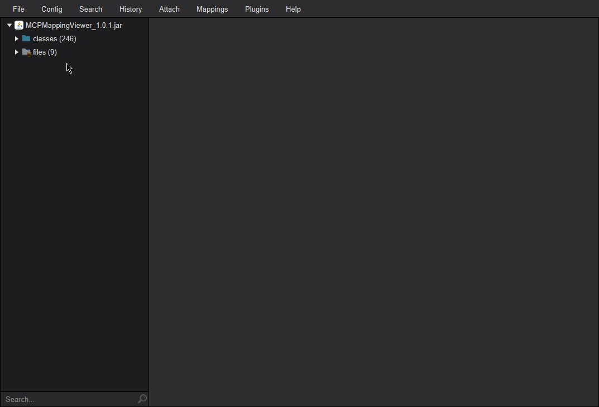
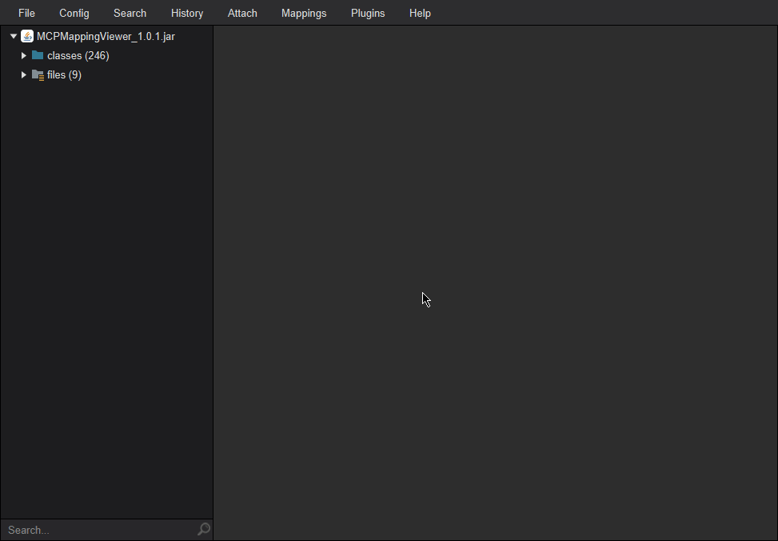

# Recaf4Forge

Inspired by [Luyten4Forge](https://github.com/KevinPriv/Luyten4Forge)

## What is this?

This is a plugin for Recaf which can automatically detects a Minecraft Forge Mods version using the mcmod.info and
applies the correct mapping. It also allows you to export the Forge MDK for the version.

The mappings are stored in this jar file, so you don't have to manually find them.

The mappings currently work for 1.8, 1.8.9 and 1.9.4

The Forge MDK export works for 1.8.9 and 1.9.4 

### Example Usage

  
Click here to see an example of automatic mappings

  
Click here to see an example of manual mappings

## TODO

- Notifications
- Add support for other versions
- Add translations?

### Contributing

Contributors are welcome 👍🏽

Thanks [Recaf-development](https://github.com/videogame-player/recaf-development) for the gradle plugin
